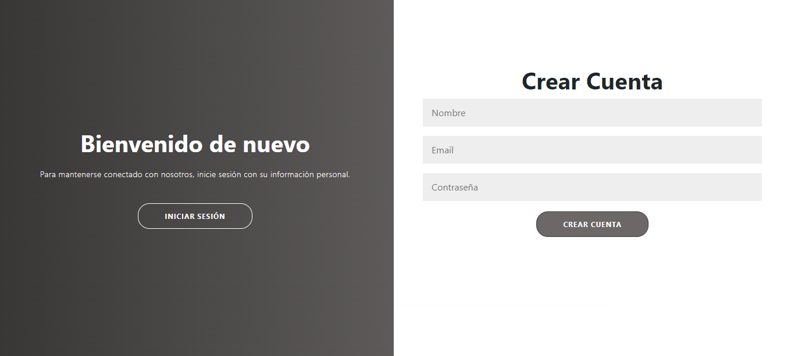
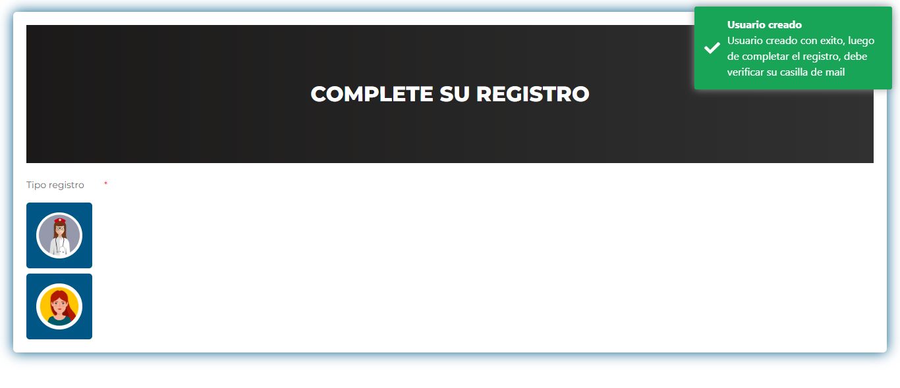
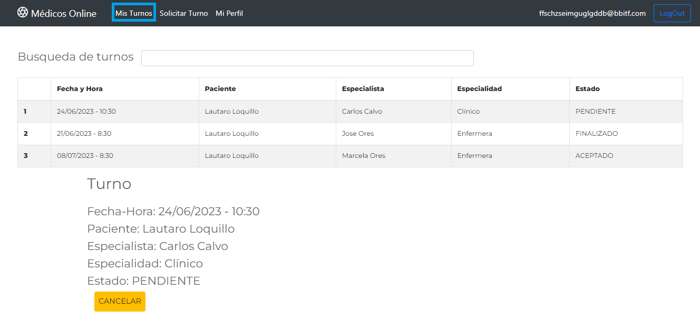
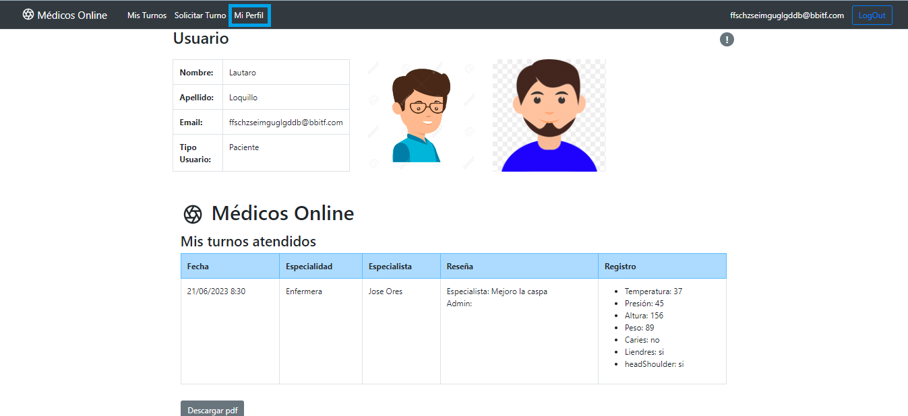

# Clinica Online

Desde nuestra fundación nuestra misión es cuidarte.
Bienvenido al espacio virtual de la clínica, desde este espacio podrás crearte un usuario tanto como paciente o especialista, en ambos casos deberás verificar tu mail para el ingreso al sistema.

Para accesos rápidos contas en el inicio de sesión contarás con pacientes, especialistas y un administrador por defecto.

Desde el rol de paciente podrás generar tu perfil, sacar turnos con los variados especialistas, ver, modificar y cancelar los turnos que tengas asignados. Desde tu perfil podrás descargar un excel, donde verás todas las atenciones que iniciaste y finalizaste en la clínica, sumando los detalles de la atención que indicó el especialista. Además cómo nuestra prioridad es que te encuentres satisfecho con nosotros habilitamos un espacio para que puedas dejar un comentario luego de la atención o el porque debes cancelar un turno.

Desde el rol de especialista, podrás añadir tus especializaciones y los horarios disponibles para tomar turnos. Al igual que desde el rol del paciente, podrás ver, modificar o cancelar los turnos que tengas asignados. Si el mismo ha finalizado tendrás un espacio para dar de alta la historia clínica, indicando las puntos medidos e importantes de la consulta. Eso sí, para acceder a todas estas funcionalidades, primero deberás ser aprobado por el administrador para el acceso al sistema. 

Los usuarios administradores tienen la potestá de habilitar o deshabilitar especialistas según corresponda, además de tomar turnos para pacientes específicos si así se requiere. La funcionalidad de ver todos los turnos generados en "Clínica Online" y sus estados se encuentra disponible sólo para estos perfiles. Como administradores tienen la posibilidad de generar nuevos usuarios administradores.

Una de las nuevas funcionalidades del administrador, es poder descargar un excel detallando todos los turnos que inició cualquier paciente que seleccione.

"ClínicaOnline" es lo que estabas necesitando, animate a probar nuestro sitio completamente amigable, con un look and feel totalmente renovado.

https://tpclinicaferrero.web.app/
